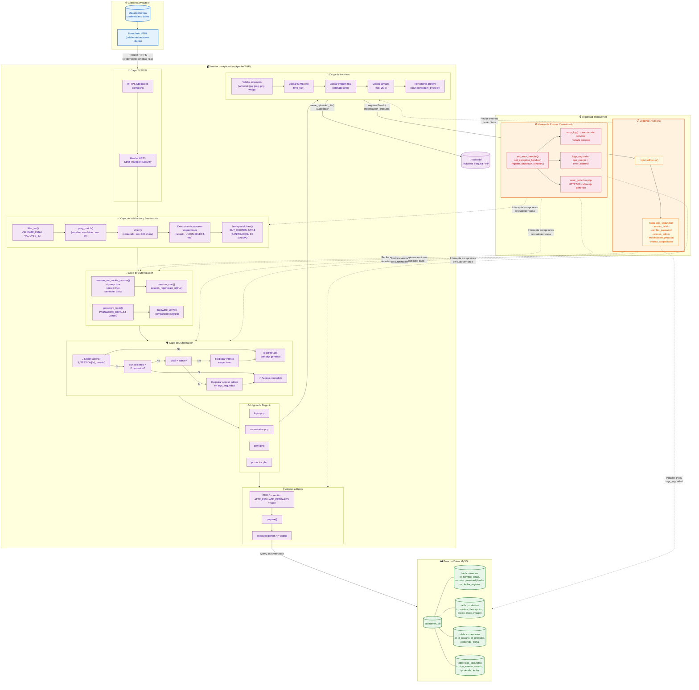

```mermaid
flowchart TD
    %% =============================================================
    %% CASO PRACTICO 10 - FastMarket S.A.C.
    %% Diagrama de flujo de seguridad - Version Corregida
    %% =============================================================

    subgraph CLIENTE["🌐 Cliente (Navegador)"]
        C1[("Usuario ingresa<br/>credenciales / datos")]
        C2["Formulario HTML<br/>(validacion basica en cliente)"]
        C1 --> C2
    end

    subgraph SEGURIDAD["🔒 Seguridad Transversal"]
        direction TB
        subgraph ERRORES["❌ Manejo de Errores Centralizado"]
            E1["set_error_handler()<br/>set_exception_handler()<br/>register_shutdown_function()"]
            E2["error_log() → Archivo del servidor<br/>(detalle tecnico)"]
            E3["logs_seguridad<br/>tipo_evento = 'error_sistema'"]
            E4["error_generico.php<br/>HTTP 500 - Mensaje generico"]
            E1 --> E2
            E1 --> E3
            E1 --> E4
        end
        subgraph LOGGING["📋 Logging / Auditoria"]
            L1["registrarEvento()"]
            L2["Tabla logs_seguridad<br/>- intento_fallido<br/>- cambio_password<br/>- acceso_admin<br/>- modificacion_producto<br/>- intento_sospechoso"]
            L1 --> L2
        end
    end

    subgraph SERVIDOR["🖥️ Servidor de Aplicación (Apache/PHP)"]

        subgraph HTTPS["🔐 Capa TLS/SSL"]
            S0["HTTPS Obligatorio<br/>config.php"]
            S0B["Header HSTS<br/>Strict-Transport-Security"]
            S0 --> S0B
        end

        subgraph VALIDACION["✅ Capa de Validación y Sanitización"]
            V1["filter_var()<br/>VALIDATE_EMAIL, VALIDATE_INT"]
            V2["preg_match()<br/>(nombre: solo letras, max 50)"]
            V3["strlen()<br/>(contenido: max 300 chars)"]
            V4["Deteccion de patrones<br/>sospechosos<br/>(&lt;script&gt;, UNION SELECT, etc.)"]
            V5["htmlspecialchars()<br/>ENT_QUOTES, UTF-8<br/>(SANITIZACION DE SALIDA)"]
            V1 --> V2 --> V3 --> V4
            V4 --> V5
        end

        subgraph AUTH["🔑 Capa de Autenticación"]
            A1["session_set_cookie_params()<br/>httponly: true<br/>secure: true<br/>samesite: Strict"]
            A2["session_start()<br/>session_regenerate_id(true)"]
            A3["password_hash()<br/>PASSWORD_DEFAULT (bcrypt)"]
            A4["password_verify()<br/>(comparacion segura)"]
            A1 --> A2
            A3 --> A4
        end

        subgraph AUTORIZACION["🛡️ Capa de Autorización"]
            Z1["¿Sesion activa?<br/>$_SESSION['id_usuario']"]
            Z2["¿ID solicitado =<br/>ID de sesion?"]
            Z3["¿Rol = admin?"]
            Z4["✅ Acceso concedido"]
            Z5["❌ HTTP 403<br/>Mensaje generico"]
            Z1 -- No --> Z5
            Z1 -- Si --> Z2
            Z2 -- Si --> Z4
            Z2 -- No --> Z3
            Z3 -- Si --> Z6["Registrar acceso admin<br/>en logs_seguridad"] --> Z4
            Z3 -- No --> Z7["Registrar intento<br/>sospechoso"] --> Z5
        end

        subgraph LOGICA["⚙️ Lógica de Negocio"]
            B1["login.php"]
            B2["comentarios.php"]
            B3["perfil.php"]
            B4["productos.php"]
        end

        subgraph FILEUPLOAD["📁 Carga de Archivos"]
            F1["Validar extension<br/>(whitelist: jpg, jpeg, png, webp)"]
            F2["Validar MIME real<br/>finfo_file()"]
            F3["Validar imagen real<br/>getimagesize()"]
            F4["Validar tamaño<br/>(max 2MB)"]
            F5["Renombrar archivo<br/>bin2hex(random_bytes(8))"]
            F1 --> F2 --> F3 --> F4 --> F5
        end

        subgraph PDO["🗄️ Acceso a Datos"]
            P1["PDO Connection<br/>ATTR_EMULATE_PREPARES = false"]
            P2["prepare()"]
            P3["execute([:param => valor])"]
            P1 --> P2 --> P3
        end

        S0B --> VALIDACION
        VALIDACION --> AUTH
        AUTH --> AUTORIZACION
        AUTORIZACION --> LOGICA
        LOGICA --> FILEUPLOAD
        LOGICA --> PDO

        %% Conexiones a seguridad transversal
        ERRORES -.->|"Intercepta excepciones<br/>de cualquier capa"| VALIDACION
        ERRORES -.->|"Intercepta excepciones<br/>de cualquier capa"| AUTH
        ERRORES -.->|"Intercepta excepciones<br/>de cualquier capa"| AUTORIZACION
        ERRORES -.->|"Intercepta excepciones<br/>de cualquier capa"| PDO
        LOGGING -.->|"Recibe eventos<br/>de autenticacion"| AUTH
        LOGGING -.->|"Recibe eventos<br/>de autorizacion"| AUTORIZACION
        LOGGING -.->|"Recibe eventos<br/>de archivos"| FILEUPLOAD
    end

    subgraph BD["🗃️ Base de Datos MySQL"]
        DB1[("fastmarket_db")]
        DB2[("tabla: usuarios<br/>id, nombre, email,<br/>usuario, password (hash),<br/>rol, fecha_registro")]
        DB3[("tabla: productos<br/>id, nombre, descripcion,<br/>precio, stock, imagen")]
        DB4[("tabla: comentarios<br/>id, id_usuario, id_producto,<br/>contenido, fecha")]
        DB5[("tabla: logs_seguridad<br/>id, tipo_evento, usuario,<br/>ip, detalle, fecha")]
        DB1 --- DB2
        DB1 --- DB3
        DB1 --- DB4
        DB1 --- DB5
    end

    %% Flujo principal
    C2 -->|"Request HTTPS<br/>(credenciales cifradas TLS)"| HTTPS
    P3 -->|"Query parametrizada"| BD

    %% Carga de archivos conecta a uploads y BD
    FILEUPLOAD -->|"move_uploaded_file()<br/>a /uploads/"| U1[("📂 uploads/<br/>.htaccess bloquea PHP")]
    FILEUPLOAD -->|"registrarEvento(<br/>modificacion_producto)"| L1

    %% Conexiones de logging a BD
    L2 -.->|"INSERT INTO<br/>logs_seguridad"| BD

    %% Estilos
    classDef clientStyle fill:#e3f2fd,stroke:#1565c0,stroke-width:2px,color:#0d47a1
    classDef serverStyle fill:#f3e5f5,stroke:#7b1fa2,stroke-width:1px,color:#4a148c
    classDef securityStyle fill:#fff3e0,stroke:#e65100,stroke-width:2px,color:#bf360c
    classDef dbStyle fill:#e8f5e9,stroke:#2e7d32,stroke-width:2px,color:#1b5e20
    classDef errorStyle fill:#fce4ec,stroke:#c62828,stroke-width:1px,color:#b71c1c
    classDef logStyle fill:#fff8e1,stroke:#f57f17,stroke-width:1px,color:#e65100

    class C1,C2 clientStyle
    class S0,S0B,V1,V2,V3,V4,V5,A1,A2,A3,A4,Z1,Z2,Z3,Z4,Z5,Z6,Z7,B1,B2,B3,B4,P1,P2,P3 serverStyle
    class F1,F2,F3,F4,F5,U1 serverStyle
    class E1,E2,E3,E4 errorStyle
    class L1,L2 logStyle
    class DB1,DB2,DB3,DB4,DB5 dbStyle
    class ERRORES,LOGGING securityStyle
```
