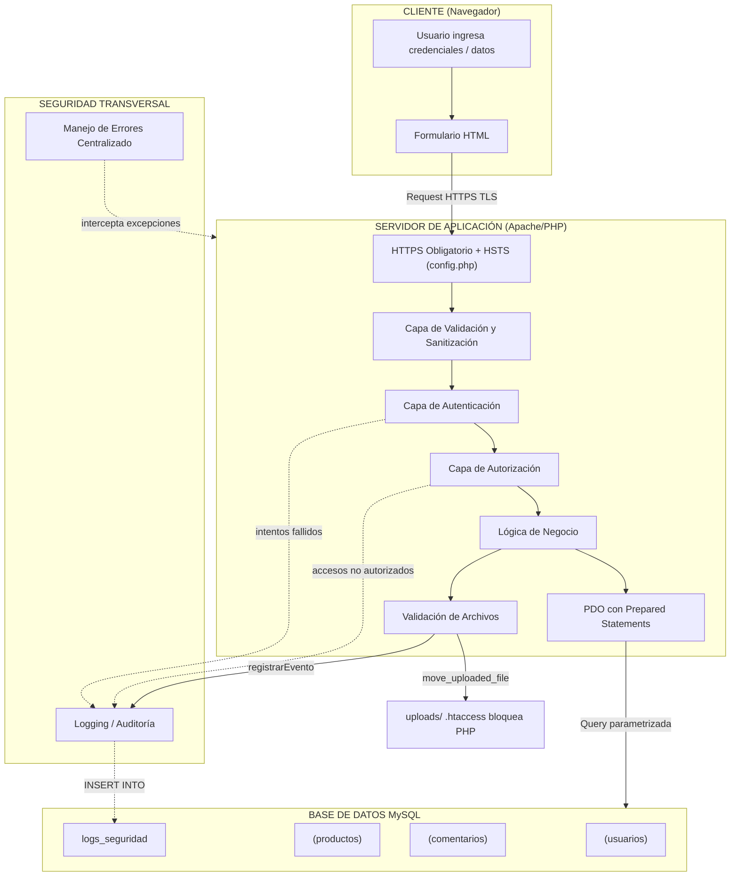

# 9. Solución propuesta

---

## 9.1. Arquitectura de seguridad (controles preventivos, detectivos y correctivos)

La arquitectura de seguridad implementada en la versión corregida de **FastMarket S.A.C.** se estructura en tres capas defensivas alineadas con el marco **OWASP Top 10 (2021)**, aplicando el principio de **defensa en profundidad**: múltiples barreras de seguridad de modo que la falla de una no comprometa todo el sistema.

### 9.1.1. Controles preventivos

Los controles preventivos impiden que la vulnerabilidad sea explotada antes de que ocurra. Se implementaron en cada punto de entrada de la aplicación.

| Control | Caso resuelto | Descripción |
|---------|---------------|-------------|
| **Consultas parametrizadas (PDO)** | Caso 1 | Todas las consultas SQL usan prepared statements con parámetros vinculados (`:parametro`), eliminando la posibilidad de SQL Injection. PDO se configura con `ATTR_EMULATE_PREPARES => false` para ejecución a nivel del motor BD. |
| **Sanitización de salida** | Caso 2 | Todo dato generado por el usuario se imprime con `htmlspecialchars($valor, ENT_QUOTES, 'UTF-8')`, neutralizando XSS almacenado y reflejado. |
| **Control de acceso (IDOR)** | Caso 3 | Verificación de sesión activa + comparación del ID solicitado por URL contra el ID de la sesión. Los admins quedan registrados al acceder a perfiles ajenos. |
| **Cookies seguras** | Caso 4 | `httponly: true` (previene robo via XSS), `secure: true` (solo HTTPS), `samesite: Strict` (previene CSRF). `session_regenerate_id(true)` post-login previene session fixation. |
| **Whitelist extensiones/MIME** | Caso 5 | Cinco capas: whitelist de extensiones (`jpg, jpeg, png, webp`), validación MIME con `finfo_file()`, verificación con `getimagesize()`, tamaño máximo 2MB, renombrado con `bin2hex(random_bytes(8))`. |
| **Manejo seguro de errores** | Caso 6 | `display_errors = OFF`, `log_errors = ON`, `set_error_handler()`, `set_exception_handler()`, `register_shutdown_function()`. Mensajes genéricos al usuario; detalle técnico solo en `error_log()`. |
| **HTTPS + HSTS** | Caso 7 | Redirección HTTP → HTTPS (301), header `Strict-Transport-Security: max-age=31536000; includeSubDomains`, cookie con flag `Secure`. Las credenciales viajan cifradas por TLS/SSL. |
| **password_hash / verify** | Caso 9 | Contraseñas almacenadas como hash bcrypt con `password_hash(PASSWORD_DEFAULT)`. Verificación con `password_verify()` sin exponer el hash. Nunca texto plano. |
| **Validación server-side** | Caso 10 | `filter_var()`, `preg_match()`, `strlen()` en servidor. Detección de patrones sospechosos (`<script>`, `UNION SELECT`, etc.). La validación de entrada es capa adicional; la defensa principal es la sanitización de salida. |

**Recomendación adicional (no implementada en código de ejemplo):** Uso de un **Web Application Firewall (WAF)** como ModSecurity, AWS WAF o Cloudflare WAF como capa perimetral que inspeccione peticiones HTTP antes de que lleguen al código PHP.

### 9.1.2. Controles detectivos

Los controles detectivos permiten identificar que un incidente de seguridad está ocurriendo o ya ocurrió.

| Control | Caso resuelto | Descripción |
|---------|---------------|-------------|
| **Tabla logs_seguridad** | Caso 8 | Registro de eventos: `intento_fallido`, `cambio_password`, `acceso_admin`, `modificacion_producto`, `intento_sospechoso`, `acceso_exitoso`, `bloqueo_temporal`, `error_sistema`. Cada registro incluye: usuario, IP, detalle, fecha. |
| **Panel de auditoría** | Caso 8 | `panel_logs.php` — panel web restringido a admins que muestra los últimos 50 eventos con filtros por tipo, resumen con indicadores de color, y `htmlspecialchars()` en cada campo para prevenir XSS en los propios logs. |
| **Recomendación: fail2ban / SIEM** | Caso 8 | Para producción, se recomienda fail2ban (bloqueo automático de IPs) y herramientas SIEM (ELK Stack, Splunk, Wazuh) para correlacionar eventos entre múltiples fuentes. |

### 9.1.3. Controles correctivos

Los controles correctivos definen qué hacer después de detectar un incidente.

| Control | Descripción |
|---------|-------------|
| **Bloqueo temporal** | Después de 5 intentos fallidos consecutivos desde la misma IP en 10 minutos, se bloquea el login y se muestra mensaje genérico. Mitiga fuerza bruta. |
| **Invalidación de sesión** | Ante actividad sospechosa, se deniega la operación, se registra el evento y se recomienda invalidar la sesión del usuario comprometido. |
| **Plan de respuesta a incidentes** | 1) Aislar cuenta/IP comprometida. 2) Analizar `logs_seguridad` para identificar alcance. 3) Notificar al usuario afectado. 4) Rotar credenciales y backups. 5) Documentar lecciones aprendidas. |

### Matriz de controles — Casos 1 al 10

| Caso | Vulnerabilidad OWASP | Control aplicado | Tipo |
|------|---------------------|------------------|------|
| **Caso 1** | A03:2021 — Injection (SQL Injection) | Consultas parametrizadas con PDO (`prepare`/`execute` con parámetros vinculados) | Preventivo |
| **Caso 2** | A03:2021 — Injection (XSS Almacenado) | Sanitización de salida con `htmlspecialchars($valor, ENT_QUOTES, 'UTF-8')` | Preventivo |
| **Caso 3** | A01:2021 — Broken Access Control (IDOR) | Verificación de sesión + comparación de ID solicitado vs ID de sesión + control de rol admin | Preventivo |
| **Caso 4** | A07:2021 — Auth Failures (Cookies inseguras) | Cookies con `httponly: true`, `secure: true`, `samesite: Strict` + `session_regenerate_id(true)` | Preventivo |
| **Caso 5** | A04:2021 — Insecure Design (Carga de archivos) | Whitelist extensiones + MIME (`finfo_file`) + `getimagesize()` + tamaño máximo + nombre aleatorio + `.htaccess` | Preventivo |
| **Caso 6** | A05:2021 — Security Misconfiguration (Errores) | `display_errors OFF`, `log_errors ON`, `set_error_handler`, `set_exception_handler`, mensajes genéricos | Preventivo + Detectivo |
| **Caso 7** | A02:2021 — Crypto Failures (Sin HTTPS) | Redirección HTTP → HTTPS, header HSTS, cookie con flag `Secure` | Preventivo |
| **Caso 8** | A09:2021 — Logging Failures (Sin logs) | Tabla `logs_seguridad` + `registrarEvento()` + `panel_logs.php` | Detectivo |
| **Caso 9** | A07:2021 — Auth Failures (Passwords texto plano) | `password_hash()` (bcrypt) + `password_verify()` | Preventivo |
| **Caso 10** | A03:2021 — Injection (Sin validación) | Validación server-side con `filter_var()`, `preg_match()`, `strlen()` + patrones sospechosos | Preventivo + Detectivo |

---

## 9.2. Diagrama de arquitectura de seguridad



**Leyenda de colores:**
- Azul claro: Cliente
- Púrpura claro: Capas del servidor de aplicación
- Naranja: Seguridad transversal (logging)
- Rojo claro: Manejo de errores
- Verde: Base de datos

---

## 9.3. Aplicación de prueba — Backend y Frontend

### 9.3.1. Stack y entorno (PHP + MySQL + HTML/CSS/JS)

| Componente | Tecnología | Versión / Detalle |
|------------|-----------|-------------------|
| **Lenguaje Backend** | PHP | 8.x |
| **Base de datos** | MySQL / MariaDB | 5.7+ / 10.3+ |
| **Frontend** | HTML5 + CSS3 | Sin frameworks externos |
| **Conexión BD** | PDO | Con `ERRMODE_EXCEPTION`, `EMULATE_PREPARES = false`, charset `utf8mb4` |
| **Contenedor** | Docker | `php:8.2-apache` + `mysql:8` (opcional) |
| **Servidor local** | XAMPP / Laragon / `php -S` | Built-in server para desarrollo |

**Dependencias de archivos del proyecto:**

```
config.php     ? todos los módulos (HTTPS, HSTS, error handlers)
conexion.php   ? todos los módulos (PDO)
logger.php     ? login, registro, comentarios, perfil, upload, productos, panel_logs
error_generico.php ? config.php (via error handlers)
```

### 9.3.2. Módulos en versión vulnerable ("antes")

La versión vulnerable contiene código intencionalmente inseguro para fines pedagógicos. Cada módulo expone vulnerabilidades OWASP Top 10 específicas:

| Archivo | Vulnerabilidad | OWASP |
|---------|---------------|-------|
| `vulnerable/login.php` | SQL Injection por concatenación, credenciales en texto plano, cookie sin atributos de seguridad | A03, A07, A02 |
| `vulnerable/comentarios.php` | XSS almacenado (sin `htmlspecialchars`), SQL Injection en INSERT, sin validación de entrada | A03, A10 |
| `vulnerable/perfil.php` | IDOR: sin verificación de sesión ni autorización, sin `htmlspecialchars` | A01, A03 |
| `vulnerable/upload.php` | Sin validación de extensión/MIME/tamaño, nombre original (path traversal), sin `.htaccess` | A04 |
| `vulnerable/error_demo.php` | `display_errors = ON`, `die($e->getMessage())`, se expone versión PHP, rutas, estructura BD | A05 |
| `vulnerable/conexion.php` | Sin charset configurado, errores expuestos | A05, A09 |

### 9.3.3. Módulos en versión corregida ("después")

| Archivo | Controles implementados | Casos OWASP |
|---------|------------------------|-------------|
| `login.php` | Prepared statements, `password_verify`, cookies seguras, `session_regenerate_id`, logging de intentos, bloqueo por fuerza bruta | 1, 4, 6, 7, 8, 9 |
| `comentarios.php` | `htmlspecialchars()`, prepared statements, validación server-side, detección de patrones sospechosos, logging | 1, 2, 8, 10 |
| `perfil.php` | Verificación sesión + autorización IDOR, HTTP 403 genérico, logging de accesos admin | 1, 2, 3, 6, 8 |
| `upload.php` | Whitelist extensiones, `finfo_file`, `getimagesize`, `random_bytes`, `.htaccess`, logging | 2, 5, 6, 8 |
| `config.php` | HTTPS + HSTS, `display_errors = OFF`, `set_error_handler`, `set_exception_handler`, `register_shutdown_function` | 6, 7 |
| `productos.php` | Prepared statements (CRUD), control de acceso admin, logging de cada operación | 1, 2, 3, 6, 8, 10 |
| `panel_logs.php` | Panel admin con filtros, `htmlspecialchars()` en logs, control de acceso | 2, 3, 8 |
| `registro.php` | `password_hash()`, prepared statements, validación de entrada, logging de registro | 9, 10 |

---

## 9.4. Código corregido por vulnerabilidad

### 9.4.1. Consultas parametrizadas (SQLi — Caso 1)

**Problema:** En la versión vulnerable, las consultas SQL se construían concatenando directamente el input del usuario, permitiendo que un payload como `admin' OR '1'='1` modificara la lógica de la consulta.

**Solución:** Prepared statements de PDO con parámetros vinculados. El motor de base de datos separa la estructura SQL de los datos, eliminando la posibilidad de inyección.

**Ejemplo — Login (login.php:80-83):**

```php
// VULNERABLE (version anterior):
// $sql = "SELECT * FROM usuarios WHERE usuario='$usuario' AND password='$password'";
// $resultado = $pdo->query($sql);
// Payload: admin' OR '1'='1 ? retorna TODOS los usuarios

// CORREGIDO:
$stmt = $pdo->prepare("SELECT * FROM usuarios WHERE usuario = :usuario");
$stmt->execute([':usuario' => $usuario]);
$usuario_db = $stmt->fetch(PDO::FETCH_ASSOC);
```

**Ejemplo — Comentarios INSERT (comentarios.php:165-171):**

```php
// VULNERABLE:
// $sql = "INSERT INTO comentarios VALUES ($id_usuario, $id_producto, '$contenido')";
// $pdo->query($sql);

// CORREGIDO:
$stmt = $pdo->prepare("INSERT INTO comentarios (id_usuario, id_producto, contenido)
                       VALUES (:id_usuario, :id_producto, :contenido)");
$stmt->execute([
    ':id_usuario'  => $id_usuario,
    ':id_producto' => $id_producto,
    ':contenido'   => $contenido,
]);
```

**Ejemplo — Perfil SELECT (perfil.php:171-173):**

```php
// VULNERABLE:
// $sql = "SELECT * FROM usuarios WHERE id = $id";
// Payload: ?id=1 UNION SELECT 1,2,3,4,5,6,7,8--

// CORREGIDO:
$stmt = $pdo->prepare("SELECT * FROM usuarios WHERE id = :id");
$stmt->execute([':id' => $id_solicitado]);
$usuario = $stmt->fetch(PDO::FETCH_ASSOC);
```

**Configuración PDO que refuerza la protección (conexion.php:18-27):**

```php
$pdo = new PDO(
    "mysql:host=$host;dbname=$dbname;charset=utf8mb4",
    $username, $password,
    [
        PDO::ATTR_ERRMODE            => PDO::ERRMODE_EXCEPTION,
        PDO::ATTR_DEFAULT_FETCH_MODE => PDO::FETCH_ASSOC,
        PDO::ATTR_EMULATE_PREPARES   => false, // ejecuta prepared statements a nivel del motor BD
    ]
);
```

---

### 9.4.2. Sanitización de entrada/salida (XSS — Caso 2)

**Problema:** En la versión vulnerable, los datos del usuario se imprimían directamente en HTML sin sanitizar. Un comentario con `<script>alert('XSS')</script>` se ejecutaba en el navegador de cada visitante.

**Solución:** `htmlspecialchars($valor, ENT_QUOTES, 'UTF-8')` en toda salida HTML.

| Carácter | Entidad HTML | Previene |
|----------|-------------|----------|
| `<` | `&lt;` | `<script>`, `<iframe>`, `` |
| `>` | `&gt;` | Cierre de etiquetas |
| `&` | `&amp;` | Inyección de entidades |
| `"` | `&quot;` | Escape de atributos HTML |
| `'` | `&#039;` | Escape de atributos con comilla simple |

**Ejemplo — Renderizado de comentarios (comentarios.php:282-284):**

```php
// VULNERABLE:
// echo $com['nombre'];      // XSS via nombre
// echo $com['contenido'];   // XSS via contenido

// CORREGIDO:
echo htmlspecialchars($com['nombre'], ENT_QUOTES, 'UTF-8');
echo htmlspecialchars($com['contenido'], ENT_QUOTES, 'UTF-8');
```

**Nota de diseño:** La sanitización de salida es la **defensa principal** contra XSS. La validación de entrada (Caso 10) es una capa adicional de defensa en profundidad.

---

### 9.4.3. Control de autorización por sesión (IDOR — Caso 3)

**Problema:** En la versión vulnerable, cualquier visitante podía acceder directamente a `perfil.php?id=1` y ver los datos del admin. Sin verificación de sesión ni autorización.

**Solución:** Tres barreras de verificación:

```php
// 1. Verificar sesión activa
if (!isset($_SESSION['id_usuario'])) {
    header('Location: login.php');
    exit;
}

// 2. Obtener y validar el ID solicitado
$id_solicitado = filter_var($_GET['id'] ?? $_SESSION['id_usuario'], FILTER_VALIDATE_INT);
if ($id_solicitado === false) {
    $id_solicitado = $_SESSION['id_usuario'];
}

// 3. Verificar autorización
if ($id_solicitado != $id_sesion && $rol !== 'admin') {
    registrarEvento($pdo, 'intento_sospechoso', $_SESSION['usuario'],
        "Intento de acceso no autorizado - ID $id_sesion intento ver perfil ID $id_solicitado");
    http_response_code(403);
    echo "No tienes permiso para ver este recurso.";  // mensaje genérico ambiguo
    exit;
}

// 4. Si es admin viendo perfil ajeno, registrar para auditoría
if ($rol === 'admin' && $id_solicitado != $id_sesion) {
    registrarEvento($pdo, 'acceso_admin', $_SESSION['usuario'],
        "Admin vio perfil de " . $usuario['usuario'] . " (ID: $id_solicitado)");
}
```

---

### 9.4.4. Cookies seguras: HttpOnly, Secure, SameSite (Caso 4)

**Problema:** Cookies sin atributos de seguridad. Permitía robo de sesión via XSS, interceptación en red, y CSRF.

**Solución:** `session_set_cookie_params()` antes de `session_start()` en todos los módulos:

```php
session_set_cookie_params([
    'lifetime' => 0,           // Cookie de sesión
    'path'     => '/',
    'secure'   => true,        // Solo HTTPS
    'httponly' => true,        // JavaScript no accede a la cookie
    'samesite' => 'Strict',   // No se envía en requests cross-origin
]);
session_start();
```

Prevención de session fixation (login.php:125):

```php
session_regenerate_id(true);  // Regenerar ID post-login
$_SESSION['id_usuario'] = $usuario_db['id'];
$_SESSION['usuario']    = $usuario_db['usuario'];
$_SESSION['rol']        = $usuario_db['rol'];
```

| Atributo | Sin este control | Con este control |
|----------|-----------------|------------------|
| `httponly` | JS puede leer cookie ? XSS roba sesión | Cookie inaccesible para JS |
| `secure` | Cookie viaja por HTTP ? se intercepta | Cookie solo viaja por HTTPS |
| `samesite` | Cookie se envía en cross-origin ? CSRF | Cookie solo en requests del mismo sitio |

---

### 9.4.5. Validación de tipo y extensión de archivos (Caso 5)

**Problema:** Sin validación. Un atacante podía subir `shell.php` y ejecutarlo vía navegador (Remote Code Execution).

**Solución:** Cinco capas de validación en cascada + protección del directorio:

**Configuración (upload.php:37-51):**

```php
$extensiones_permitidas = ['jpg', 'jpeg', 'png', 'webp'];
$mimes_permitidos = ['image/jpeg', 'image/png', 'image/webp'];
$tamano_maximo_bytes = 2 * 1024 * 1024; // 2MB
$directorio_uploads = __DIR__ . '/uploads';
```

**Capa 1 — Extensión:** `pathinfo($nombre, PATHINFO_EXTENSION)` contra whitelist. "imagen.jpg.php" ? extensión "php" ? RECHAZADO.

**Capa 2 — Tamaño:** `$archivo['size'] > $tamano_maximo_bytes` ? RECHAZADO.

**Capa 3 — Imagen real:** `getimagesize($archivo['tmp_name'])` ? si retorna false, no es imagen ? RECHAZADO.

**Capa 4 — MIME real:** `finfo_file(finfo_open(FILEINFO_MIME_TYPE), ...)` ? MIME no permitido ? RECHAZADO.

**Capa 5 — Nombre aleatorio:**

```php
$nuevo_nombre = bin2hex(random_bytes(8)) . '.' . $extension;
// Ejemplo: "a3f8b2c1e9d04f67.jpg" — elimina path traversal, sobrescritura
```

**Protección del directorio uploads/ (.htaccess):**

```apache
<FilesMatch "\.php[0-9]*$">
    Require all denied
</FilesMatch>
<FilesMatch "\.(php|php[0-9]*|phtml|cgi|pl|sh|asp|aspx|jsp)$">
    Require all denied
</FilesMatch>
Options -Indexes
```

---

### 9.4.6. Hash de contraseñas (bcrypt / password_hash — Caso 9)

**Problema:** Contraseñas en texto plano en la BD. Comparación directa con `===`.

**Solución:** `password_hash()` (bcrypt) + `password_verify()`:

**Registro (registro.php:39):**

```php
$password_hash = password_hash($password, PASSWORD_DEFAULT);
// Genera: $2y$10$N9qo8uLOickgx2ZMRZoMyeIjZAgcfl7p92ldGxad68LJZdL17lhWy
// Algoritmo (2y=bcrypt), costo (10), salt aleatorio, hash
```

**Login (login.php:120):**

```php
// VULNERABLE: if ($usuario_db['password'] === $password)  ? texto plano

// CORREGIDO:
if ($usuario_db && password_verify($password, $usuario_db['password'])) {
    session_regenerate_id(true);
    // ... crear sesión
}
```

| Aspecto | Texto plano (vulnerable) | bcrypt hash (corregido) |
|---------|-------------------------|------------------------|
| Almacenamiento | `"admin123"` | `"$2y$10$N9qo8uLOickg..."` |
| Comparación | `===` directa | `password_verify()` |
| Si roban la BD | Contraseñas legibles | Hash irrevertible (costoso) |
| Salt | No tiene | Integrado en el hash |

---

### 9.4.7. Manejo de errores personalizado (Caso 6)

**Problema:** `display_errors = ON`, `die($e->getMessage())`, se expone versión PHP, rutas del servidor, estructura de BD, consultas SQL completas.

**Solución:** Tres manejadores globales en `config.php`:

**1. Desactivar display_errors (config.php:101-103):**

```php
ini_set('display_errors', '0');
ini_set('display_startup_errors', '0');
ini_set('log_errors', '1');
```

**2. set_error_handler — errores PHP no fatales (config.php:132-165):**

```php
set_error_handler(function (int $errno, string $errstr, string $errfile, int $errline) {
    if (!in_array($errno, [E_ERROR, E_PARSE, E_CORE_ERROR, E_COMPILE_ERROR, E_USER_ERROR])) {
        return false;  // notices y warnings se manejan normalmente
    }
    error_log("PHP Error [$errno]: $errstr in $errfile on line $errline");
    http_response_code(500);
    require __DIR__ . '/error_generico.php';
    exit;
});
```

**3. set_exception_handler — excepciones no capturadas (config.php:181-222):**

```php
set_exception_handler(function (Throwable $exception) {
    error_log("Excepcion no manejada: " . $exception->getMessage() .
              " in " . $exception->getFile() .
              " on line " . $exception->getLine());
    // Registrar en logs_seguridad si PDO disponible
    if (isset($pdo) && $pdo instanceof PDO) {
        try {
            $stmt = $pdo->prepare("INSERT INTO logs_seguridad (...) VALUES (...)");
            $stmt->execute([':tipo' => 'error_sistema', ...]);
        } catch (PDOException $e) { /* al menos queda en error_log */ }
    }
    http_response_code(500);
    require __DIR__ . '/error_generico.php';
    exit;
});
```

**4. register_shutdown_function — errores fatales (config.php:232-247):**

```php
register_shutdown_function(function () {
    $error = error_get_last();
    if ($error !== null && in_array($error['type'], [E_ERROR, E_PARSE, E_CORE_ERROR, E_COMPILE_ERROR])) {
        error_log("PHP Fatal Error: " . $error['message'] . " in " . $error['file']);
        http_response_code(500);
        require __DIR__ . '/error_generico.php';
    }
});
```

**Comparación — Lo que ve el usuario vs lo que se registra:**

| Información | VULNERABLE | CORREGIDO |
|-------------|-----------|-----------|
| Mensaje error SQL | `SQLSTATE[42S02]: Table 'fastmarket_db.tabla' doesn't exist` | "Ha ocurrido un error. Por favor intenta más tarde." |
| Versión PHP | `phpversion()` expuesto | NO expuesto |
| Servidor web | `$_SERVER['SERVER_SOFTWARE']` expuesto | NO expuesto |
| Ruta absoluta | `__FILE__` expuesto | NO expuesta |
| Versión MySQL | `SELECT VERSION()` expuesto | NO expuesta |
| Error registrado | NO | `error_log()` + `logs_seguridad` |

---

### 9.4.8. Registro de eventos (logging — Caso 8)

**Problema:** Sin registro de eventos. Imposible detectar fuerza bruta, accesos no autorizados, o actividad sospechosa.

**Solución:** Función reutilizable `registrarEvento()` en `logger.php`:

```php
function registrarEvento(PDO $pdo, string $tipo_evento, ?string $usuario, string $detalle): void
{
    try {
        $stmt = $pdo->prepare(
            "INSERT INTO logs_seguridad (tipo_evento, usuario, ip, detalle)
             VALUES (:tipo_evento, :usuario, :ip, :detalle)"
        );
        $stmt->execute([
            ':tipo_evento' => $tipo_evento,
            ':usuario'     => $usuario,
            ':ip'          => $_SERVER['REMOTE_ADDR'] ?? '0.0.0.0',
            ':detalle'     => $detalle,
        ]);
    } catch (PDOException $e) {
        error_log("logger.php - Error al registrar evento: " . $e->getMessage());
    }
}
```

**Tipos de evento implementados:**

| Tipo | Módulo | Descripción |
|------|--------|-------------|
| `intento_fallido` | `login.php` | Credenciales incorrectas |
| `acceso_exitoso` | `login.php`, `registro.php` | Login exitoso, nuevo registro |
| `acceso_admin` | `login.php`, `perfil.php` | Admin accede a recurso privilegiado |
| `cambio_password` | (módulo futuro) | Modificación de contraseña |
| `modificacion_producto` | `productos.php`, `upload.php` | Alta, baja, edición, carga de imagen |
| `intento_sospechoso` | `comentarios.php`, `perfil.php`, `upload.php`, `panel_logs.php` | Contenido rechazado, acceso no autorizado |
| `bloqueo_temporal` | `login.php` | Bloqueo por 5+ intentos en 10 min |
| `error_sistema` | `config.php`, `error_demo.php` | Errores PHP/SQL registrados internamente |

**Ejemplo de uso en login.php — intento fallido:**

```php
$ip = $_SERVER['REMOTE_ADDR'] ?? '0.0.0.0';
registrarEvento($pdo, 'intento_fallido', $usuario, "Intento fallido desde IP: $ip");
```

**Ejemplo de uso en perfil.php — acceso no autorizado:**

```php
registrarEvento($pdo, 'intento_sospechoso', $_SESSION['usuario'],
    "Intento de acceso no autorizado - ID $id_sesion intento ver perfil ID $id_solicitado");
```

---

### 9.4.9. Habilitación de HTTPS (Caso 7)

**Problema:** Sitio accessible solo por HTTP. Credenciales en texto plano viajando por la red. Interceptación trivial con Wireshark, tcpdump o Firesheep.

**Solución:** Tres capas de protección en `config.php`:

**1. Redirección HTTP ? HTTPS (config.php:54-65):**

```php
$es_https = !empty($_SERVER['HTTPS']) && $_SERVER['HTTPS'] !== 'off'
            || ($_SERVER['SERVER_PORT'] ?? 80) == 443
            || ($_SERVER['HTTP_X_FORWARDED_PROTO'] ?? '') === 'https';

if (!$es_https) {
    $host = $_SERVER['HTTP_HOST'] ?? $_SERVER['SERVER_NAME'];
    $uri  = $_SERVER['REQUEST_URI'] ?? '/';
    header("Location: https://$host$uri", true, 301);
    exit;
}
```

**2. Header HSTS (config.php:87):**

```php
header('Strict-Transport-Security: max-age=31536000; includeSubDomains', false);
// Le dice al navegador: "NUNCA accedas a este dominio por HTTP"
// max-age=31536000 ? 1 año
```

**3. Headers de seguridad adicionales (config.php:96-99):**

```php
header('X-Content-Type-Options: nosniff', false);
header('X-Frame-Options: DENY', false);
header('X-XSS-Protection: 1; mode=block', false);
header('Referrer-Policy: strict-origin-when-cross-origin', false);
```

**Comparación — Login Vulnerable vs Corregido:**

| Aspecto | VULNERABLE (HTTP) | CORREGIDO (HTTPS) |
|---------|-------------------|-------------------|
| Protocolo | `http://localhost/login.php` | `https://localhost/login.php` |
| Credenciales | Viajan en texto plano | Cifradas con TLS/SSL |
| Cookie sesión | Sin flag `Secure` | Con flag `Secure` |
| Sniffing | Fácil con Wireshark | Imposible (datos cifrados) |
| MitM | Ataque trivial | Protegido por cifrado TLS |

**Evidencia de tráfico:**

```
VULNERABLE (HTTP):
  POST /login.php HTTP/1.1
  usuario=admin&password=admin123        ? LECTURABLE por la red

CORREGIDO (HTTPS):
  POST /login.php HTTPS/1.1
  [datos cifrados con TLS - NO legibles] ? Cifrado e incomprensible
```

**Configuración para desarrollo local (certificado autofirmado):**

```powershell
# Generar certificado válido por 365 días
openssl req -x509 -nodes -days 365 -newkey rsa:2048 `
  -keyout C:\xampp\apache\conf\ssl-certs\localhost.key `
  -out C:\xampp\apache\conf\ssl-certs\localhost.crt `
  -subj "/CN=localhost/O=FastMarket/C=PE"
```

**Para producción:** Usar Let's Encrypt (certbot) para certificado SSL gratuito y renovación automática.

---
